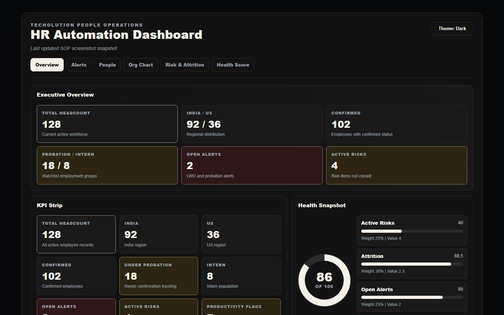

# HR Automation Dashboard SOP



*Hero page screenshot captured from the current HtmlService Web App shell with representative dashboard data.*

## How To Use This SOP

This SOP is written for two audiences:

- Reviewers who need to verify that the submitted dashboard works as required.
- Maintainers who need to set up, deploy, operate, or troubleshoot the workbook and Web App.

Start with **Quick Start** when setting up the project for the first time. Use **Daily Usage Guide** for normal HR operations. Use **Web App Deployment**, **Acceptance Verification**, and **Submission Checklist** before final handoff.

## Contents

- Quick Start
- Access Model At A Glance
- Architecture
- Daily Usage Guide
- Threshold Modification Guide
- Real-Time Reflection
- Trigger Installation
- Web App Deployment
- Workflow Actions
- HR Health Score
- Acceptance Verification
- Security Review
- Troubleshooting
- Change Management
- Submission Checklist

## Quick Start

Use this sequence for a clean setup or final verification run:

1. Open the Apps Script project attached to the target Google Sheet.
2. Confirm the Apps Script files are saved with the current repository contents.
3. Run `setupWorkbook()` to create tabs, seed `_Config`, and protect generated sheets.
4. Run `runAllTests()` and confirm the `Logs` tab shows passing test output.
5. Run `installTriggers()` as the deployment owner.
6. Run `runFullPipeline("manual")`.
7. Deploy the Web App with the settings in **Web App Deployment**.
8. Share the underlying Sheet with `aadish.jain@techolution.com` as Viewer.
9. Confirm `AUTH_DEV_ALLOWLIST_ENABLED = false` in `webApp.gs`.
10. Complete the manual checks in **Acceptance Verification**.

## Access Model At A Glance

- The Web App must be deployed as **User accessing the web app**.
- The Web App must be available to **Anyone with Google account**.
- The server-side access gate only allows `@techolution.com` users.
- `AUTH_DEV_ALLOWLIST_ENABLED = false` for the current strict submission mode.
- `srmt2k6@gmail.com` is denied in strict submission mode.
- Unauthorized users receive only plain text: `access-denied`.
- Authorized users must also have Google Sheet access because the Web App runs as the visiting user.

## Architecture

The solution runs entirely on Google Sheets, Apps Script, HtmlService, and MailApp.

System flow:

```text
Source Tabs
  India Employee Database
  US Employee Database
  RM Data
  Finance-Productivity
  Risk Report
  Offboarded Resources
        |
        v
Apps Script Pipeline
  config -> dataLoader -> validation -> alerts/metrics
        |
        +--> Sheet Surfaces: Dashboard, OrgChart, DrillDown
        +--> Web App API: getDashboardData(), getFilteredEmployees(), getLastPipelineStatus()
        +--> Notifications: HR alert digest and admin self-monitoring alerts
        +--> Audit Trail: Logs and Changelog
```

Module map:

- `config.gs`: tab names, aliases, config defaults, constants, and shared contracts.
- `dataLoader.gs`: header-agnostic source readers, normalization, schema drift warnings, and formula sanitization.
- `alerts.gs`: dashboard model, LWD alerts, probation alerts, attrition, risk summary, and HR Health Score.
- `dashboardRenderer.gs`, `orgChart.gs`, `drillDown.gs`: Google Sheet output surfaces.
- `pipeline.gs`: setup, trigger entrypoints, orchestration, changelog, and partial-failure handling.
- `workflows.gs`: HR workflow actions and idempotency stamps.
- `webApp.gs`, `index.html`, `client.html`, `styles.html`: authenticated HtmlService dashboard.
- `tests.gs`: runnable acceptance harness and QA helpers.

## Daily Usage Guide

HR users should edit source tabs only:

- `India Employee Database`
- `US Employee Database`
- `RM Data`
- `Finance-Productivity`
- `Risk Report`
- `Offboarded Resources`

Generated tabs are script-owned. They are refreshed by Apps Script and should not be manually edited:

- `Dashboard`
- `OrgChart`
- `DrillDown`
- `Logs`
- `Changelog`
- `_Config`

Daily workflow:

1. Add or update employee, RM, productivity, risk, or offboarding rows in the relevant source tab.
2. Installable edit/change triggers refresh the generated Sheet surfaces.
3. `Dashboard` shows KPIs, alerts, department breakdown, attrition, risk summary, data quality warnings, and HR Health Score.
4. `OrgChart` reflects reporting-manager relationships.
5. `DrillDown` filter cells can be edited to refresh filtered employee rows.
6. The Web App polls every 5 seconds and reads the same shared dashboard model as the Sheet dashboard.
7. `Logs` records readable operational messages. `Changelog` records one row per full pipeline run.

Rule of thumb: source tabs are for input; generated tabs are for review, audit, and reporting.

## Threshold Modification Guide

Administrators update thresholds in `_Config`. The pipeline validates values and falls back to defaults when a setting is invalid.

Config keys:

- `LWD_ALERT_DAYS`: days before or after an intern LWD to show an LWD alert.
- `PROBATION_ALERT_DAYS`: days before confirmation date to show a probation alert.
- `PROBATION_DURATION_DAYS`: days after DOJ used to compute confirmation date.
- `PRODUCTIVITY_TARGET`: productivity score below which an employee is flagged.
- `HR_DIGEST_EMAIL`: alert digest recipient.
- `ADMIN_ALERT_EMAIL`: self-monitoring alert recipient.
- `PIPELINE_TRIGGER_HOUR`: daily trigger hour.
- `EMPLOYEE_ID_PATTERN`: validation regex for employee IDs.

After changing `_Config`, run `runFullPipeline("manual")` or edit a source tab row to refresh outputs.

## Real-Time Reflection

Sheet reflection:

- Source-tab edits route through `handleInstallableEdit(e)`.
- Source-tab structure changes route through `handleInstallableChange(e)`.
- `DrillDown` filter edits refresh only the filtered output.
- Daily scheduled runs use `runDailyPipeline()`.

Web App reflection:

- `doGet(e)` checks the signed-in Google account before creating any HtmlService template.
- Unauthorized users receive a plain text response containing only `access-denied`; no dashboard shell, CSS, client JavaScript, title, or app context is sent.
- Authorized users receive the HtmlService shell.
- `getDashboardData()` loads config, loads source data, builds the shared dashboard model, escapes returned strings, and sends the payload to the browser.
- `getFilteredEmployees(filters)` applies the same drill-down filters used by the Sheet surface.
- The browser polls `getDashboardData()` every 5 seconds.

Partial failures are isolated. For example, MailApp quota errors are logged and surfaced as warnings, but dashboard rendering continues.

## Trigger Installation

Run `setupWorkbook()` once before trigger installation to create tabs, seed `_Config`, and protect generated surfaces.

Run `installTriggers()` once as the deployment owner. It installs:

- installable `onEdit` trigger
- installable `onChange` trigger
- daily time-based trigger for `runDailyPipeline()`

Use `removeProjectTriggers()` before reinstalling triggers during maintenance.

Recommended setup sequence:

1. Open the Apps Script project attached to the workbook.
2. Confirm `appsscript.json` uses V8 and the required scopes.
3. Run `setupWorkbook()`.
4. Run `runAllTests()`.
5. Run `installTriggers()`.
6. Run `runFullPipeline("manual")`.
7. Review `Logs`, `Changelog`, `Dashboard`, `OrgChart`, and `DrillDown`.

## Web App Deployment

Deploy from Apps Script as a Web App with `doGet(e)` as the entrypoint.

Required deployment settings:

- Execute as: User accessing the web app
- Who has access: Anyone with Google account
- Manifest webapp setting: `executeAs` = `USER_ACCESSING`, `access` = `ANYONE`
- Application access gate: only `@techolution.com` accounts are allowed.
- Development bypass status: `AUTH_DEV_ALLOWLIST_ENABLED = false`; `srmt2k6@gmail.com` is denied in the current submission configuration.
- Client API functions: `getDashboardData()`, `getFilteredEmployees(filters)`, and `getLastPipelineStatus()`

Important permission note:

Because the Web App executes as the visiting user, every allowed user must also have access to the underlying Google Sheet. Share the workbook with the reviewer `aadish.jain@techolution.com` as Viewer before final verification.

Deployment steps:

1. Apps Script > Deploy > New deployment.
2. Select type: Web app.
3. Description: `HR Automation Dashboard`.
4. Execute as: User accessing the web app.
5. Who has access: Anyone with Google account.
6. Deploy and copy the Web App URL.
7. Open the URL as an allowed `@techolution.com` user with Sheet access and confirm the dashboard loads.
8. Open the URL as a non-Techolution Google account and confirm the page contains only `access-denied`.
9. View source/page content for the unauthorized account and confirm there is no dashboard HTML, CSS, client JavaScript, app title, or HR/Techolution context.
10. Record the deployed URL in the submission notes.

Before final submission, confirm `AUTH_DEV_ALLOWLIST_ENABLED = false` in `webApp.gs`, save, and deploy a new Web App version.

No stable deployed Web App URL is stored in source control because Apps Script generates it at deployment time.

## Workflow Actions

Workflow action columns are added to employee source tabs when missing.

Supported actions:

- `Start Offboarding`
- `Schedule PIP`
- `Approve Confirmation`

Each action is idempotent. After an action executes, the row receives execution timestamp and result stamps. Re-selecting the same action on the same stamped row does not resend email or repeat side effects.

## HR Health Score

The HR Health Score is a 0-100 composite score built from the shared dashboard model. Components are exposed separately in the Sheet Dashboard and Web App.

Score weights:

- Attrition: 30%
- Open alerts: 25%
- Active risks: 25%
- Productivity average: 20%

Component formulas:

- Attrition component = `max(0, 100 - attritionRate * 5)`
- Open alerts component = `max(0, 100 - alertCount * 10)`
- Active risks component = `max(0, 100 - activeRiskCount * 15)`
- Productivity component = productivity average

Final score:

```text
sum(componentScore * componentWeight / 100)
```

The final result is rounded and clamped between 0 and 100.

## Acceptance Verification

Run `runAllTests()` from Apps Script after deploying the latest code. The harness writes one `PASS ...` or `FAIL ...` row per test to `Logs`, followed by a summary and acceptance report line.

Automated checks covered by `runAllTests()`:

- LWD alerts
- Probation alerts
- Current-quarter attrition math
- Column reorder and alias resilience
- Config threshold changes
- Workflow idempotency
- Formula sanitization
- HtmlService escaping
- Web App payload and filter behavior
- Web App email-domain access rules
- Opaque `access-denied` denied-response text
- Partial MailApp failure behavior

Manual checks to complete in the workbook and deployed Web App:

- Add three QA employees using IDs generated by `createQaTestDataSet_()` and confirm Sheet Dashboard and Web App counts update.
- Change a probation employee DOJ and confirm probation alerts update.
- Delete a QA offboarded row and confirm attrition updates.
- Change `_Config` thresholds and confirm alert/productivity counts update.
- Enter an invalid employment status and confirm a readable validation message appears.
- Confirm `AUTH_DEV_ALLOWLIST_ENABLED = false` in `webApp.gs`.
- Open the deployed Web App as `srmt2k6@gmail.com` and confirm the page contains only `access-denied`.
- Open the deployed Web App as a real `@techolution.com` account with Sheet access and confirm the dashboard loads.
- Open the deployed Web App as a non-Techolution Google account and confirm the page contains only `access-denied`.
- View source/page content for an unauthorized account and confirm it contains no dashboard HTML, CSS, client JavaScript, app name, HR text, Techolution text, or user email.

QA cleanup must only remove rows where `isQaTestEmployeeId_(employeeId)` returns true. Do not delete or overwrite non-test employee IDs.

## Security Review

Reviewed controls:

- No credentials, API keys, tokens, passwords, or service account secrets are stored in source code.
- No `UrlFetchApp`, external database, external API, or third-party network integration is used.
- MailApp is the only outbound integration.
- Compensation fields are loaded for internal normalization but are not rendered into dashboard rows, Web App public employee rows, logs, or HR alert digest bodies.
- HtmlService responses recursively escape Sheet-provided strings before returning payloads to the browser.
- Inline initial payload JSON escapes `<`, `>`, `&`, U+2028, and U+2029 to prevent script-tag breakout.
- Client rendering uses `textContent`; it does not use `innerHTML`, `document.write`, `eval`, or dynamic code execution.
- Generated tabs and `_Config` are protected by `setupWorkbook()`.
- Web App deployment requires a Google account and then applies an Apps Script-native server-side email-domain gate.
- Unauthorized `doGet(e)` requests return plain text `access-denied` before any HtmlService dashboard shell is created.
- Browser-callable server functions (`getDashboardData()`, `getFilteredEmployees(filters)`, and `getLastPipelineStatus()`) also enforce the access gate.
- Web App read paths suppress Sheet log writes so viewer requests do not require edit access to `Logs`.
- Broad iframe embedding is not enabled in code.

Reviewer access:

- Grant `aadish.jain@techolution.com` view-only workbook access for final review.
- Grant other workbook reviewers view-only access unless they are expected to run admin setup.
- Grant Apps Script edit access only to maintainers.
- Deployment owner should be a controlled Workspace account, not a personal account.

## Troubleshooting

Check `Logs` first. Messages are plain English and include INFO, WARN, or ERROR levels.

Common issues:

- Missing source tab: run `setupWorkbook()`.
- Missing or renamed header: restore the canonical header or add an alias in `config.gs`.
- Invalid config value: correct the `_Config` row; the pipeline falls back to defaults until fixed.
- Mail quota exceeded: dashboard rendering continues; digest failure is logged and admin self-monitoring is attempted.
- Web App shows an error view: open `Logs`, fix the reported workbook/config/source issue, and refresh.
- Web App shows only `access-denied`: sign in with an allowed `@techolution.com` account, confirm `AUTH_DEV_ALLOWLIST_ENABLED` is set as intended, and confirm the signed-in account has access to the underlying Sheet.
- Allowed Web App user sees a Sheet permission error: share the workbook with that user as Viewer or Editor as appropriate.
- Trigger did not run: run `removeProjectTriggers()`, then `installTriggers()` as the deployment owner.

When troubleshooting access issues, separate the checks:

1. Is the signed-in Google account allowed by the domain gate?
2. Does that same account have permission to open the underlying Sheet?
3. Was the latest Apps Script version deployed after changing `webApp.gs`?

## Change Management

Use one git checkpoint per completed pass. Do not push mid-pass.

Recommended release process:

1. Run `runAllTests()`.
2. Run static parser checks locally when editing source files.
3. Deploy Apps Script.
4. Run the manual acceptance checks.
5. Commit with the pass checkpoint message.
6. Push to `origin/main`.
7. Record final Web App URL and workbook URL in submission notes outside source control.

## Submission Checklist

Use this as the final handoff gate:

- Source code pushed to GitHub.
- Apps Script project opened without syntax errors.
- `setupWorkbook()` completed.
- `installTriggers()` completed.
- `runAllTests()` passed.
- Manual acceptance checks completed.
- Web App deployed with the settings above.
- `AUTH_DEV_ALLOWLIST_ENABLED = false` for strict final submission.
- Reviewer `aadish.jain@techolution.com` has view-only access to the workbook.
- Reviewer has Web App access through the `@techolution.com` domain gate.
- `SOP.pdf` generated from this SOP.
